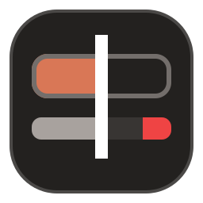
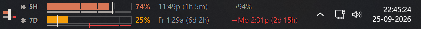
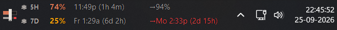
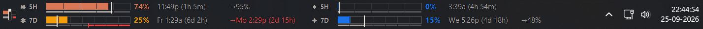
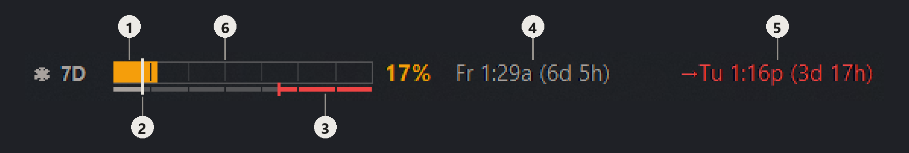
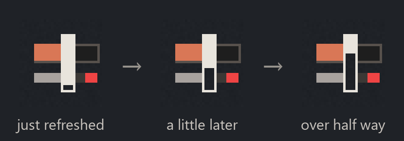
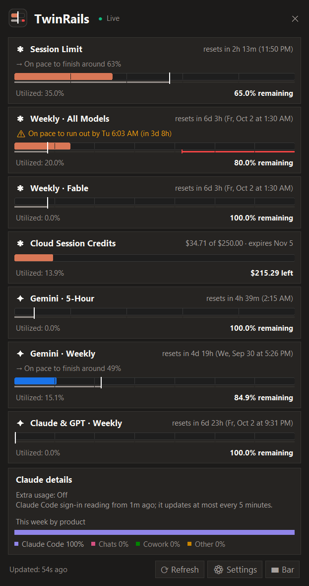
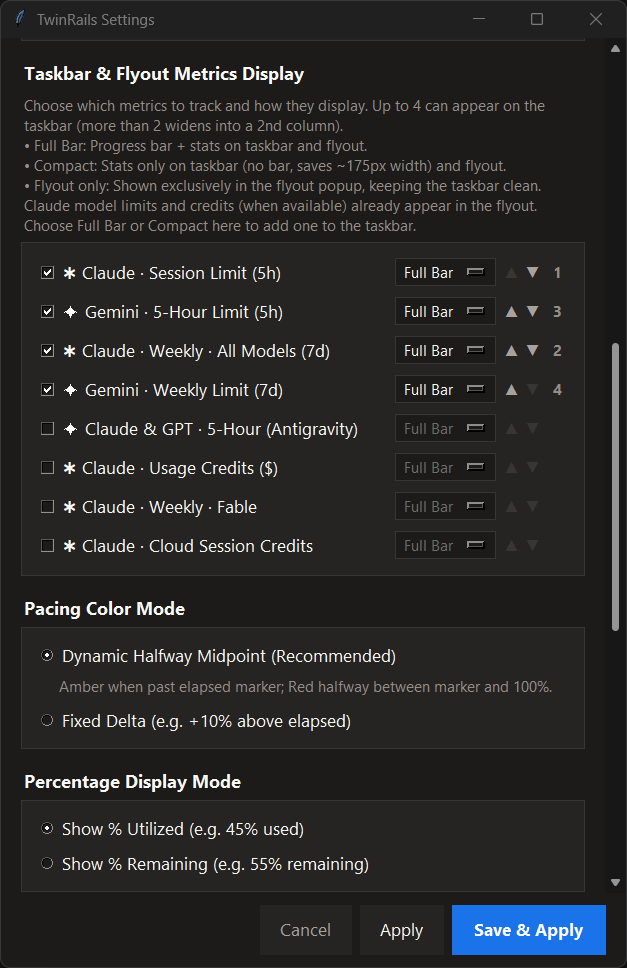

  

<h1 align="center">TwinRails</h1>

<strong>Claude and Gemini usage limits in your Windows taskbar, with a forecast of when you'll run out.</strong>

  
  
  

TwinRails is a small Windows widget that lives inside the taskbar and tracks your AI usage limits: Claude's 5-hour session limit, weekly limit and per-model limits (Claude.ai and Claude Code share them), and Gemini's limits in Google Antigravity. Instead of just a percentage, it projects your current pace forward and shows the exact time you would run out, before it happens.

*Live Windows taskbar capture. Claude's weekly limit is only 25% used, but at this pace it runs out on Monday at 2:31 PM, almost three and a half days before Friday's reset.*

## Install

Read [Risks and limits](#risks-and-limits) first.

**Download.** Get `TwinRails.exe` from the
[latest release](https://github.com/rajat-b/TwinRails/releases/latest) and run
it. There is nothing else to install.

- The exe is not code-signed yet, so Windows SmartScreen may warn you the
  first time. Choose **More info**, then **Run anyway**.
- Each release is built by [GitHub Actions](.github/workflows/ci.yml) from the
  tagged source and lists its SHA-256 checksum in `SHA256SUMS.txt`. With the
  GitHub CLI you can also check where it was built:
  `gh attestation verify TwinRails.exe -R rajat-b/TwinRails`.
- Move the exe somewhere permanent before you tick **Start automatically with
  Windows**. The startup shortcut points at the exe where it is.

**From source.** Needs Python 3.10+ and an internet connection for the first
run. Double-click `start_widget.bat`: it installs missing packages from
`requirements.txt`, using `py -3` when available and otherwise `python` on
PATH. If installation fails, open Command Prompt in the folder and run
`py -3 -m pip install -r requirements.txt` (or
`python -m pip install -r requirements.txt`). After that, `run_silent.vbs`
starts the widget in the background.

**First run.** Right-click the tray icon or click `⚙ Settings` in the flyout:

- Antigravity connects automatically if the IDE is open.
- If Claude Code is signed in, the widget can read its local OAuth token.
  Otherwise, paste your Claude `sessionKey` cookie to track Claude.ai limits.
  This cookie is a browser login credential, so only enter it if you accept
  the risks below.
- Choose which metrics you want displayed on the taskbar bar.

## What makes it different

- **It forecasts, not just reports.** Every row shows when the limit resets
  and when your current pace would use it up: `→Mo 2:31p (2d 15h)` in red when
  that comes first, or where you would finish, like `→50%`, when you are on
  track.
- **Two rails, one glance.** The bar is your quota; the thin rail under it is
  time. One needle marks *now*, so a fill running ahead of the needle means
  you are spending faster than the clock. The red stretch at the end is the
  time you would spend locked out.
- **Hour and day divisions.** A 5-hour bar is split into five sections and a
  weekly bar into seven, with matching marks on the time rail. An even pace
  uses one section per hour or per day, so being three sections into your
  quota on day two stands out without any maths.
- **It lives in the taskbar itself.** Embedded beside the clock, transparent,
  and following Windows' light or dark taskbar. There is no window to open,
  and the needle in its logo empties as the next refresh gets closer.

### Fits your taskbar

Show one limit or four, with bars or as text only. Each row can be set to
**Full Bar**, **Compact** (text only, about 175px narrower) or **Flyout only**
in Settings.

**Claude only, with bars** (the capture above)

**Claude only, Compact**

**Everything: Claude and Gemini, four rows in two columns**

## Risks and limits

This is an independent hobby project, and it is provided at your own risk. Anthropic does not sanction either of the ways TwinRails reads your Claude usage, and both use an undocumented endpoint.

- **Claude Code sign-in** (tried first). TwinRails reads the OAuth token that
  Claude Code keeps on your PC and uses it to ask for your limits. It never
  copies or stores the token. Anthropic's
  [Claude Code legal and compliance page](https://code.claude.com/docs/en/legal-and-compliance#authentication-and-credential-use)
  says OAuth sign-in is "designed to support ordinary use of Claude Code and
  other native Anthropic applications"; TwinRails is a third-party app.
- **Session cookie** (fallback). You paste your Claude.ai `sessionKey` login
  cookie, which TwinRails encrypts with Windows DPAPI and stores. The same
  page says developers "may not collect, store, or intermediate Claude.ai
  credentials or session tokens", and Anthropic's
  [Consumer Terms of Service](https://www.anthropic.com/legal/consumer-terms)
  prohibit accessing its consumer services through automated or non-human
  means except through an Anthropic API key, and also prohibit scraping and
  bypassing protective measures. This route carries the most risk.

Anthropic says it may enforce these restrictions without prior notice. Your account could be restricted, and either route can stop working at any time.

**Not affiliated with, endorsed by, or sponsored by Anthropic or Google.**

## Maintenance

TwinRails is a side project I built for my own use and share as is. I fix
things when I have time, so issues may wait a while or go unanswered, and
there are no timelines. Bug reports with the form filled in are welcome, and
pull requests even more so.

## Screenshots

These show live usage. The Settings image shows one person's choices.

### Reading a row

1. **Used so far:** 17% of the weekly limit. The fill is amber because it is
   ahead of the needle, meaning you are using the limit faster than the week
   is passing.
2. **Now:** the needle marks how far through the week you are. The grey part
   of the thin rail underneath is time already gone.
3. **Locked out:** the red stretch runs from the moment you would run out
   (the small red cap) to the reset. At this pace, that part of the week is
   spent unable to use it.
4. **Reset:** Friday 1:29 AM, 6 days 5 hours away.
5. **Run-out:** at this pace you hit the limit Tuesday 1:16 PM, in 3 days
   17 hours. Red means that comes before the reset. When you are on track,
   this shows where you would finish instead, like `→50%`.
6. **Day divisions:** the weekly bar is split into seven sections, one per
   day of the reset window, with matching marks on the rail (a 5-hour bar
   gets five, one per hour). An even pace uses one section per day. Here,
   less than a day in, the fill is already past the first section: ahead of
   pace.

**The refresh countdown.** The needle in the logo at the left end of the bar
is a tiny gauge. It is solid the moment new numbers land and empties from the
bottom as the next automatic check gets closer, leaving a hollow outline. It
turns amber while a check is running, so you can tell at a glance whether you
are looking at fresh numbers. Click the logo to refresh straight away.

**Details flyout**

**Settings: choosing metrics**

---

## Supported Providers

- **Claude**: Session limits (5h), weekly quotas (7d), each reported per-model limit (such as Fable, Opus, or Sonnet), and usage credits when a spending cap and amount used are available. The flyout also shows extra usage status and Claude's labeled weekly breakdown when returned.
- **Google Antigravity (`Gemini & 3P`)**: Local zero-configuration loopback engine tracking Gemini 5-hour sprint limits, weekly quotas, and third-party Claude/GPT limits in Antigravity.

---

## Features

- **Embedded Windows Taskbar Bar**:
  - Genuinely embedded directly into Windows Explorer (`Shell_TrayWnd`) next to the tray/clock cluster.
  - **Transparent background by default** — the bar paints nothing behind itself, so the real taskbar shows through and it matches exactly, including a translucent Windows 11 taskbar whose color shifts across its width with your wallpaper. The unfilled part of each progress bar is hollow too, outlined rather than filled. Untick it in Settings for a solid panel instead.
  - The text follows Windows' own light or dark taskbar setting, including when you switch it while the widget is running. Prefer a solid panel? Untick transparency in Settings → Taskbar Bar Appearance and pick its color for a dark and for a light taskbar. See [docs/bar-colors.md](docs/bar-colors.md).
  - Displays up to 4 metrics of your choice (more than 2 adds a second column), each marked with its provider:
    - `[ ✱ 5H: 45% · 4:12p (1h 28m) · →40% ]`
    - `[ ✦ 5H: 14% · 6:34p (3h 50m) · →5:02p (1h 18m) ]`
  - Each row draws two tracks: the bar itself is **quota** (how much you have
    spent, with the right-hand edge as the only limit), and a slim **time rail**
    beneath it is the **reset window** — how much of it has passed, and, in red,
    the stretch at the end you would spend locked out at your current pace, with
    a stop cap marking the moment you run dry. A single high-contrast needle runs
    through both to mark *now*; if the fill is ahead of the needle you are
    burning faster than the clock. See [docs/reading-the-bar.md](docs/reading-the-bar.md).
  - Two time fields per row, each an exact clock time with its countdown bracketed
    after it: when the window resets, and where your current pace lands you —
    `→8:15p (1h 19m)` in red when you are on track to run out before the reset,
    `→40%` otherwise.
  - Pacing color transition: Signature brand colors (`#D97756` Claude Coral, `#1A73E8` Gemini Blue) → Warning Amber (`#F59E0B`) → Danger Red (`#EF4444`).
- **Left Twin Rails Button**:
  - Single-click immediate refresh across all enabled providers, styled with the widget's signature colored Twin Rails mark (Claude Coral quota bar, time rail with danger lockout tail, and synchronized white needle).
  - The mark's needle doubles as a refresh countdown: solid when data has just
    landed, emptying to a hollow outline by the time the next auto-refresh is
    due, so staleness is readable at a glance. Turns amber while a fetch is
    actually running.
  - Hover tooltip showing action prompt and last-updated time.
  - Bars dim while a refresh is in flight, and pick up an amber tint (staying dim) for
    any metric whose provider is currently disconnected — the tint clears only once
    that provider reconnects, so it reads as "actually broken" rather than "still loading".
- **Click-to-Open Windows 11 Fluent Flyout**:
  - Left-clicking either the tray badge or the taskbar progress bars opens an anchored, dark-themed flyout showing full card breakdowns for each provider.
  - Reported Claude model limits and usage credits appear automatically in the flyout. Settings can add any of them to the taskbar. A capped credits card shows money left in Claude's reported currency; the flyout scrolls if there are too many rows for the screen. Claude does not provide an exact token balance in this response.
  - **Cloud session credits**, when your account has them, get their own card: money left of the included credit, and the date it expires.
  - **This week by product**: one stacked bar showing how your week's Claude usage splits across Claude Code, Chats, Cowork and Other, with a legend giving each share.
- **Taskbar System Tray Icon**:
  - A fixed colored Twin Rails badge in the Windows Notification Area — deliberately static (no percentage or status color baked into the icon itself) so it stays recognizable at a glance in a tray full of other icons.
  - Hover tooltip displays multi-line breakdown of all active AI quotas and countdowns.
- **Security & Privacy**:
  - Claude Code OAuth tokens are read from Claude Code's local credentials file and are not copied into the widget config.
  - Claude session keys are encrypted at rest using Windows DPAPI (`CryptProtectData`).
  - Antigravity connects directly to the local language server on `127.0.0.1` with zero cloud transmission.
- **Silent Background Execution**:
  - One-click **Start automatically with Windows** toggle in Settings. It starts `TwinRails.exe`, or `run_silent.vbs` when you run from source.

---

## FAQ

### How do I see my Claude usage limits in the Windows taskbar?

Run TwinRails (see [Install](#install)). Claude's 5-hour and weekly limits appear in
the taskbar with their reset times, and clicking the bar opens a flyout with
every limit Claude reports.

### Does it work with Claude Code?

Yes. Claude Code and Claude.ai share the same plan limits, and those are what
TwinRails shows. It can use Claude Code's own sign-in on your PC, so there is
no cookie to paste, though that route updates at most every 5 minutes. The
flyout also shows how much of your week went to Claude Code versus chats.

### When does my Claude 5-hour limit reset?

Each row shows the exact reset time and a countdown, such as
`11:49p (4h 18m)`. The weekly limit adds the day: `Fr 1:29a (6d 5h)`.

### Will I run out before it resets?

That is the time on the right of each row. Red means your current pace hits
the limit before the reset, and when. Otherwise it shows where you would
finish, such as `→50%`.

### Does it track Gemini?

Yes, through Google Antigravity running on the same PC: Gemini's 5-hour and
weekly limits, plus the Claude and GPT limits inside Antigravity. There is
nothing to set up.

### Is it safe to use?

Read [Risks and limits](#risks-and-limits) first. In short: Anthropic does
not allow third-party apps to use Claude sign-in credentials like this, and
your account could be restricted. TwinRails only talks to Claude (`claude.ai` or
`api.anthropic.com`) and to Antigravity on your own PC. There is no analytics
or other network traffic.

### Which Windows versions does it run on?

It is built and tested on Windows 11, 64-bit. Running from source needs
Python 3.10 or later.

---

## Documentation

Developer notes live in [`docs/`](docs/README.md) — start there before
changing any of the win32 code that puts the bar inside the taskbar.
Changes between versions are in [CHANGELOG.md](CHANGELOG.md), and
[SECURITY.md](SECURITY.md) covers what TwinRails does with your credentials
and how to report a vulnerability privately.
