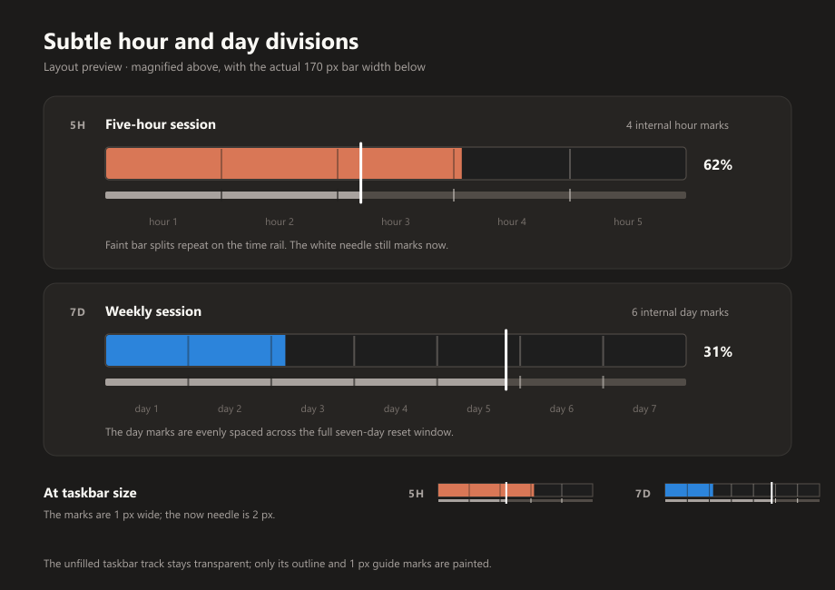

# Reading the bar: two rails, not one

Each metric row draws two horizontal tracks, and they measure different
things. Getting them mixed up is the mistake this layout exists to prevent.

```
  5H  [############--------------]  62%   9:36p (2h 45m)   →8:15p (1h 19m)
      ~~~~~~~~~|~~~~~~~~|##########
               ^ now    ^ you run dry here
```

The same thing in a real capture — Claude's weekly row, 17% used but on pace
to run out about two and a half days before the reset. The numbered parts are explained in
the [README](../README.md#reading-a-row).


**The bar (top) is quota.** Its length is the percentage of the limit you
have spent. Its only end point is the right-hand edge — that edge, and
nothing else, is "you have run out".

**The rail (bottom, 3px) is time.** Its full width is the reset window. The
light part is how much of the window has already passed. The red tail at the
end is the stretch you would spend locked out at the current pace, and the
vertical cap at the head of that tail is the moment the quota runs dry.

**The needle spans both.** It marks *now*, which is the one fact that means
the same thing on either rail. Running it through both is what ties them
into a single gauge: if the bar's fill front is ahead of the needle, you are
burning quota faster than the clock is burning the window.

## Hour and day guides



Four faint internal lines divide a 5-hour window into five sections; six
divide a 7-day window into seven. They appear in both the taskbar row and the
flyout card. At the taskbar's 170px bar width, that puts the marks 34px apart
for 5H and about 24.3px apart for 7D. The [original SVG
mockup](mockups/session-divisions.svg) shows the intended weight at enlarged
and actual size.

Settings → Taskbar Bar Appearance → **Show hour/day divisions (taskbar and
flyout)** turns these marks on or off in both views. It is on by default,
including for configs saved before the option existed. Apply redraws the bars
without waiting for another usage update.

The marks are 1px wide. Inside the coloured fill they expose the background
as a narrow gap; over the empty taskbar track they are the only added pixels.
The rest of that unfilled track remains completely transparent in transparent
mode. Matching short marks appear on the time rail. The 2px now needle and
the red run-out cap stay on top of them. Only 5-hour and 168-hour
`UsageWindow` metrics get guides; credits and other window lengths do not.

The lines in the *usage* bar are visual guides, not literal hour or day
boundaries in quota consumed. The rail below is the time axis. A weekly
"day" here means a 24-hour slice from the start of that reset window, not a
calendar day that begins at midnight. This distinction matters when a
weekly window resets in the middle of a day.

## Why the projection is not drawn on the bar

It used to be. `custom_progress.py` and `taskbar_bar.py` both drew the
projected run-out point as a dashed red vertical line straight across the
usage bar, on the same axis as the fill.

That put a moment in *time* onto an axis of *quantity*. The two share the
same 170 pixels and normalise to the same 0–1 range, so it looked like a
legitimate comparison, but nothing about the fill's length can be measured
against a clock position. What it actually produced was a red line sitting
ahead of an advancing fill, which reads unavoidably as a wall the fill is
racing toward — as though usage stops when the two meet. It does not. The
fill's wall is the right-hand edge, always, and the dashed line was really a
prediction about where the *needle* would be when the bar hit that edge.

Splitting time onto its own rail makes that collision impossible to draw.

Alternatives that were considered and rejected:

- **Move the markers outside the track** (a caret above for now, one below
  for the run-out point). Cheapest possible fix, and it does remove the
  false collision, but it keeps the projection encoded as a bare position
  with nothing to read it against.
- **Shade the doomed stretch of the bar** instead of drawing a line. The
  fill slides over the shading and muddies both.
- **A "ghost fill"** extending the bar to the utilization you would reach at
  reset. Genuinely elegant — it stays entirely on the quota axis — but it
  discards the *when*, which is the part worth knowing.

## Why the red tail is anchored to the end of the window

The obvious alternative is to draw it from *now* to the run-dry point, so it
shows the lead you have left. That was tried and rejected: that segment
shrinks as you consume the lead, so the warning gets visually smaller
precisely as the situation gets worse.

Anchored to the end of the window instead, the tail is the time you would
spend with nothing left. It grows as you overspend, which is the right
direction, and its length is directly meaningful — a tail covering a quarter
of the rail means roughly a quarter of this window spent locked out. The
stop cap at its head is what keeps the tail from reading as a vague smear:
the cap is the event, the tail is its consequence.

## What the text says

The row carries two time fields, drawn as two canvas items so they can be
coloured separately:

| Field | Example | Meaning |
|---|---|---|
| reset | `9:36p (2h 45m)` | when the window resets, and how long that is |
| pace projection | `→8:15p (1h 19m)` or `→40%` | where this pace lands you |

Each clock time carries its own countdown in brackets. The clock time leads
because it is the fixed fact; the countdown is derived from it and from now.
Bracketing rather than dot-separating is what makes the pairing visible: as
four dot-separated values (`2h 45m · 9:36p · →8:15p · 1h 19m`) the row is
four equally-weighted numbers with no grouping, and you have to work out
which countdown belongs to which time.

The projection has two forms and one meaning. When you are on track to run
out before the reset, it is the clock time you go dry plus how long you have
until then, drawn in red. When you are not, it is the utilization you would
finish the window at, drawn in the ordinary secondary colour — no countdown
there, because a landing percentage is not a moment to count down to. The
leading arrow is on both forms, and earns its pixels in the first: without
it, the projection is a bare clock time sitting immediately after another
bare clock time.

`→` never shows `100%`. A projection at or over 100 produces a run-out time
and takes the other branch, so a printed `100%` could only be a rounding
artifact of 99.5-something — which would read as "you run out" in the one
branch that exists to say you do not. It is clamped to 99.

Nothing is shown until 3% of the window has elapsed. Before that the
denominator is tiny and the projection swings wildly between refreshes.

## Widths

The four text slots are sized at startup from the widest text each can
hold, measured in the running app's own fonts, plus a little slack —
`_calibrate_text_slots()` in `taskbar_bar.py`. They are not fixed pixel
counts, because the text is not a fixed pixel size (see the gotcha below).
The widest strings and what they measure:

| Slot | Widest string | 100% scaling | 125% scaling | Slot at 125% |
|---|---|---|---|---|
| `TAG_W` (8pt bold) | `✱ OPU` | 39px | 46px | 49 |
| `PCT_W` (9pt bold) | `100%` | 31px | 40px | 43 |
| `TIME_W` (9pt) | `Mo 12:34p (6d 23h)` | 101px | 129px | 139 |
| `PACE_W` (9pt) | `→Mo 12:34p (6d 23h)` | 111px | 142px | 152 |

At 100% the slots come out at 42, 34, 111 and 121, which is the old
hard-coded layout to within a pixel; `Mo` turned out 1px wider than the `We`
the old numbers were measured from. A four-metric two-column bar is 1060px
wide at 100% and 1210px at 125%. When adding anything to the row, add its
widest string to `_TEXT_SLOT_SAMPLES` rather than hard-coding a width.

There is no slack left elsewhere in the row to reclaim.
Claude's scoped weekly rows use the first three letters of the model name
(`FAB`, `OPU`, `SON`) in that slot, since another `7D` would make the
all-model and model-specific rows indistinguishable. The full name stays in
the flyout and Settings. Names with the same first three letters can share a
taskbar tag; the flyout resolves that ambiguity.

Three letters do not always fit. The `MOD` fallback, used when a model name
has no usable letters, measures 43px, so it spills 1px into the gap that
follows it (5px before the bar, 8px in compact rows). That is harmless, but a
future model whose name starts with wide letters (`W`, `M`) could spill
further — measure before assuming it fits.

**Gotcha: text grows with Windows display scaling, and the geometry does
not.** Found on 2026-09-25 in a live capture from a 125%-scaled display,
back when the slots were fixed pixel counts. The app is DPI-aware, so Tk
draws 9pt text at the display's real DPI, 25% wider at 125%. In that
capture, `We 5:26p (4d 21h)` ran straight into its projection and read
`(4d 21h)→47%`, and a red run-out time ended 9px from the next column's
provider mark. Fixed by measuring at startup, above.

Two traps for anyone measuring by hand:

- A standalone `python -c "…measure(s)"` is **DPI-unaware** and always
  reports 96-DPI widths, whatever the display. That is how the old numbers
  were wrong. Call `src.ui.dpi.enable_per_monitor_dpi_v2()` before creating
  the Tk root to see what the app sees.
- Only the text slots scale. The bar, rail and gaps stay fixed pixels, since
  the taskbar's height limits them and it does not grow with the text. So
  the whole bar is wider on a scaled display. At 150% a four-metric layout
  should come to roughly 1350px (estimated from the 125% measurements, not
  measured), which may not fit beside the centred taskbar icons on a
  1920px-wide screen. Choose fewer metrics or compact rows there, or use the
  width lever below.

**The width lever**, if the row ever has to get narrower, is the weekday
prefix on these clock times. Once a countdown sits in brackets beside it,
`12:34p (6d 23h)` cannot be misread as today, so `We` is convenience rather
than information. Dropping it from both fields gives back roughly 54px per
column. It is kept because the exact time — weekday included — is the part
of this row that gets used for planning.

## Metrics with no clock

A credits balance has no reset window, so `has_time_window` is false and the
rail is not drawn at all for it. Drawing an empty rail instead was rejected:
an empty rail reads as "no time has passed", which is false rather than
merely uninformative.

## Colours

The rail's two neutral tones follow the sampled taskbar theme exactly as the
track and needle do — the unfilled rail uses the track outline colour, the
elapsed portion uses the secondary text colour. Its red parts do not: like
the percentage text, they are drawn straight onto the taskbar with nothing
behind them once the background is transparent, so they go through
`_legible_marking_color()` on every update. See
[Choosing the bar's colors](bar-colors.md).
